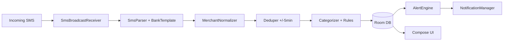

# Personal Expense & Budget Tracker — Architecture (v1)

High-level Android architecture for the product defined in [Budget_Tracker_PRD.md](Budget_Tracker_PRD.md). No source code in this document.

---

## 1. Goals

- Ingest bank SMS locally, parse with bank-specific templates, deduplicate, categorize, persist.
- Run alerts and monthly jobs without requiring daily app opens.
- Keep sensitive data on-device by default; optional encrypted backup per PRD.

---

## 2. Stack

| Layer | Choice |
|--------|--------|
| Language | Kotlin |
| Min SDK | 26 (adjust if team standard differs) |
| UI | Jetpack Compose |
| Architecture | MVVM (or MVI where it fits flows) |
| DI | Hilt |
| Async | Kotlin Coroutines + Flow |
| Local DB | Room (SQLite) |
| Preferences | DataStore |
| Background | WorkManager |
| Notifications | NotificationManager + channels |

Optional: **SQLCipher** (or encrypted file + Keystore-wrapped key) if threat model requires DB-at-rest encryption beyond device encryption.

---

## 3. Module boundaries (suggested)

```
:app                 # Application, navigation, theme, DI modules
:feature-onboarding  # Optional: permissions + first-run
:feature-budget      # Categories, month rollover UI
:feature-transactions# List, detail, edit, needs-review queue
:feature-alerts      # Local notification scheduling hooks (thin)
:core-data           # Room entities, DAOs, repositories
:core-sms            # Receiver, parser, templates, normalizer, deduper
:core-domain         # Pure Kotlin: rollup math, alert eligibility, predictive formula
```

Monolith `:app` only is acceptable for MVP; split when build times or ownership demand it.

---

## 4. SMS pipeline



1. **`SmsBroadcastReceiver`** — Listens for `SMS_RECEIVED`, filters sender/heuristic to “likely bank” before heavy work (reduce battery).
2. **`SmsParser`** — Loads active `BankTemplate`(s) for user-selected bank + language; runs regex; emits structured `ParsedSms` + `confidence`.
3. **`MerchantNormalizer`** — Produces `normalized_merchant` and `normalized_merchant_token` for dedup and rules.
4. **`Deduper`** — Applies PRD rules (amount, card, merchant similarity, ±5 min); handles pending → settled merge via `dedup_hash`.
5. **`Categorizer`** — Looks up `Rule` by token; else uncategorized; sets `status` from confidence.
6. **`TransactionRepository`** — Single write path to Room (transactions + optional alert side effects enqueue).

All steps run off the main thread (coroutine `Dispatchers.Default` or injected dispatcher).

---

## 5. Storage (Room)

- **Entities** align with PRD §5: `Transaction`, `Category`, `Rule`, `BankTemplate`, `AlertEvent`, `Card` (optional).
- **Indices:** `(category_id, date)`, `(normalized_merchant_token, date)`, `(month)` on categories, `(category_id, month, threshold)` on `AlertEvent` for idempotent alert sends.
- **Migrations:** Version `BankTemplate` rows; ship seed migrations for bank regex packs.

---

## 6. Background work (WorkManager)

| Worker | Schedule | Purpose |
|--------|----------|---------|
| `MonthRolloverWorker` | 1st of month **00:05** local | Create new month category draft from previous month; reset in-app “month context”; no deletion of transactions |
| `MonthlySummaryWorker` | 1st **09:00** local | Compute prior month rollups; fire summary notification |
| `PredictiveAlertWorker` | Daily ~**08:05** (after quiet hours) | Evaluate predictive formula; write `AlertEvent`; notify |
| `ThresholdAlertWorker` | On transaction insert/update **or** periodic coalesce | Re-evaluate 70/85/100%; respect quiet hours and dedupe via `AlertEvent` |

Exact split (transaction-triggered vs periodic) is implementation detail; PRD requires idempotent `AlertEvent` rows.

---

## 7. Notifications

- **Channels:** `alerts_threshold`, `alerts_predictive`, `summary_monthly`, `needs_review_digest` (optional batched digest for low-confidence parses).
- **Quiet hours:** 22:00–08:00 local — queue; flush at 08:00 (PRD §4.7.1).
- **Deep links:** Open transaction or category screen from notification.

---

## 8. Backup (optional v1)

- **Google Drive AppFolder:** Export encrypted JSON snapshot (transactions, categories, rules — **exclude** or hash `raw_sms` per privacy choice) on user action or periodic schedule.
- Restore: merge or replace policy must be documented in app copy (replace is simpler for v1).

If PRD open question defers backup, ship **export to file** (SAF) first; same schema.

---

## 9. Security & privacy

- No raw SMS in logcat in release builds.
- ProGuard/R8 keep rules for Room/Hilt only; do not strip template assets.
- Play Console: declare SMS usage per financial transaction parsing; link in-app disclosure screen.

---

## 10. Testing strategy

- **Golden SMS corpus:** `src/test/resources/sms/*.txt` — expected `ParsedSms` + confidence; regression on every template change.
- **Unit tests:** `core-domain` for rollup, predictive projection, small-category filter, top-N selection.
- **Integration:** Room + repository in-memory or Android instrumented tests for dedup and alert idempotency.
- **Optional debug UI:** “Rule simulator” — paste SMS, see parse + category without persisting.

---

## 11. Dependencies (reference only)

Typical Gradle coordinates (versions managed by catalog):

- `androidx.room:room-*`
- `androidx.work:work-runtime-ktx`
- `androidx.datastore:datastore-preferences`
- `com.google.dagger:hilt-android`
- `androidx.compose.*`

Drive versions from Android BOM where applicable.

---

## 12. Out of scope (this document)

- Backend API design (v1 local-only).
- CI/CD pipeline specifics.
- Exact regex for each bank (lives with `BankTemplate` seeds and tests).
