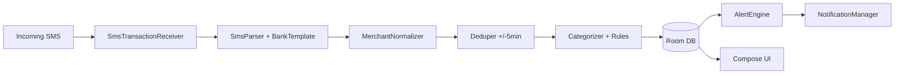

# Personal Expense & Budget Tracker — Architecture (v1)

High-level Android architecture for the product defined in [Budget_Tracker_PRD.md](Budget_Tracker_PRD.md). No source code in this document.

---

## 1. Goals

- Ingest bank SMS locally, parse with bank-specific templates, deduplicate, categorize, persist.
- Run alerts and monthly jobs without requiring daily app opens.
- Keep sensitive data on-device by default; optional encrypted backup per PRD.

---

## 2. Stack


| Layer         | Choice                               |
| ------------- | ------------------------------------ |
| Language      | Kotlin                               |
| Min SDK       | 26 (adjust if team standard differs) |
| UI            | Jetpack Compose                      |
| Architecture  | MVVM (or MVI where it fits flows)    |
| DI            | Hilt                                 |
| Async         | Kotlin Coroutines + Flow             |
| Local DB      | Room (SQLite)                        |
| Preferences   | DataStore                            |
| Background    | WorkManager                          |
| Notifications | NotificationManager + channels       |


Optional: **SQLCipher** (or encrypted file + Keystore-wrapped key) if threat model requires DB-at-rest encryption beyond device encryption.

---

## 3. Module boundaries (shipped)

**Single `:app` module** — Kotlin, Compose UI, Hilt, Room, DataStore, WorkManager, and SMS receiver live under `app/src/main/java/com/anasexpenses/budget/` with MVVM layers (`ui/`, `domain/`, `data/`, plus `sms/`, `alerts/`, `work/`). The multi-module layout below remains a **future split** if build times or ownership demand it.

```
:app (current)        # All of the above in one Gradle module
:feature-* / :core-* # Optional future extraction only
```

---

## 4. SMS pipeline




1. `**SmsTransactionReceiver**` — Listens for `SMS_RECEIVED`; assembles multipart bodies; **does not** pre-filter the body (wording varies; non-matches are cheap). `**ArabBankSmsFilter**` is reserved for **inbox backfill** narrowing, not the live receiver path.
2. `**RegexBankSmsParser**` (+ Room `BankTemplateEntity` + shipped fallbacks) — Runs regex / Arabic Click paths; emits parsed fields + `confidence`.
3. `**MerchantNormalizer**` — Produces `normalized_merchant` and `normalized_merchant_token` for dedup and rules.
4. `**Deduper**` — Applies PRD rules (amount, card, merchant similarity, ±5 min); handles pending → settled merge via `dedup_hash`.
5. `**Categorizer**` — Looks up `Rule` by token; else uncategorized; sets `status` from confidence / currency policy.
6. `**TransactionRepository**` — Single write path to Room; applies **`CurrencyToJodConverter`** for supported non-JOD SMS currencies (static offline rates; unknown codes → no insert). Stored money is milli-JOD; non-JOD SMS rows are marked **`needs_review`**. After insert, **`BudgetAlertCoordinator.refreshAlerts`** for the transaction’s labeled budget month.

All steps run off the main thread (coroutine `Dispatchers.Default` or injected dispatcher).

---

## 5. Storage (Room)

- **Entities** align with PRD §5: `Transaction`, `Category`, `Rule`, `BankTemplate`, `AlertEvent`, `Card` (optional).
- **Indices:** `(category_id, date)`, `(normalized_merchant_token, date)`, `(month)` on categories, `(category_id, month, threshold)` on `AlertEvent` for idempotent alert sends.
- **Migrations:** Version `BankTemplate` rows; ship seed migrations for bank regex packs.

---

## 6. Background work (WorkManager)


| Worker / alarm          | Schedule / trigger                                   | Purpose (shipped)                                                                                              |
| ----------------------- | ----------------------------------------------------- | -------------------------------------------------------------------------------------------------------------- |
| `DailyBudgetWorker`     | WorkManager **~24h**                                  | `refreshAlerts` for the current labeled month; optional **SQLite copy** to a user-picked SAF tree URI (`anas-budget-daily-backup.db`) if daily backup is enabled               |
| AlarmManager hooks      | Rollover **00:05**, daily summary **~09:00** (local)  | Month copy + summary notification paths (see `BudgetAlarmScheduler` / receivers in repo)                     |

Threshold and predictive notifications are evaluated inside **`BudgetAlertCoordinator`** (on ingest, worker, and alarm-driven `refreshAlerts`), not as separate named WorkManager workers.

Exact split (transaction-triggered vs periodic) is implementation detail; PRD requires idempotent `AlertEvent` rows.

---

## 7. Notifications

- **Channels:** `alerts_threshold`, `alerts_predictive`, `summary_monthly`, `needs_review_digest` (optional batched digest for low-confidence parses).
- **Quiet hours:** 22:00–08:00 local — queue; flush at 08:00 (PRD §4.7.1).
- **Deep links:** Open transaction or category screen from notification.

---

## 8. Backup (v1 shipped)

- **Manual export:** Settings — user picks a document; app checkpoints WAL and copies the Room SQLite file (SAF), same as one-off backup file naming in UI strings.
- **Optional daily copy:** User grants a **folder** (tree URI); `DailyBudgetWorker` writes `anas-budget-daily-backup.db` into that folder on each run when configured. No cloud upload in v1.

**v2:** Google Drive AppFolder / encrypted JSON remains out of scope until explicitly added.

---

## 9. Security & privacy

- No raw SMS in logcat in release builds.
- ProGuard/R8 keep rules for Room/Hilt only; do not strip template assets.
- Play Console: declare SMS usage per financial transaction parsing; link in-app disclosure screen.

---

## 10. Testing strategy

- **Golden SMS corpus:** `src/test/.../RegexBankSmsParserTest` (and resources) — regression on template / parser changes.
- **Unit tests:** `app/src/test/...` — domain (e.g. `PredictiveEvaluatorTest`, `BudgetCycleTest`, `MerchantNormalizerTest`), money (`CurrencyToJodConverterTest`), seeds (`DefaultCategorySeedsTest`, `MerchantRuleSeedsTest`), bulk import, parser tests.
- **CI:** `.github/workflows/android.yml` assembles debug and runs `testDebugUnitTest` on Ubuntu + JDK 17.
- **Integration:** Room + repository instrumented tests where present under `androidTest/`.
- **Debug UI:** Settings “paste SMS” ingest path.

---

## 11. Dependencies (reference only)

Typical Gradle coordinates (versions managed by catalog):

- `androidx.room:room-`*
- `androidx.work:work-runtime-ktx`
- `androidx.datastore:datastore-preferences`
- `com.google.dagger:hilt-android`
- `androidx.compose.*`

Drive versions from Android BOM where applicable.

---

## 12. Out of scope (this document)

- Backend API design (v1 local-only).
- Exact regex for each bank (lives with `BankTemplate` seeds, `BudgetSeed` fallbacks, and tests).

**CI:** `.github/workflows/android.yml` builds and runs unit tests on `main`/`master` and PRs (no APK artifact). Optional **`.github/workflows/apk-test-build.yml`** uploads a debug APK artifact on manual dispatch or `v*` tags.

